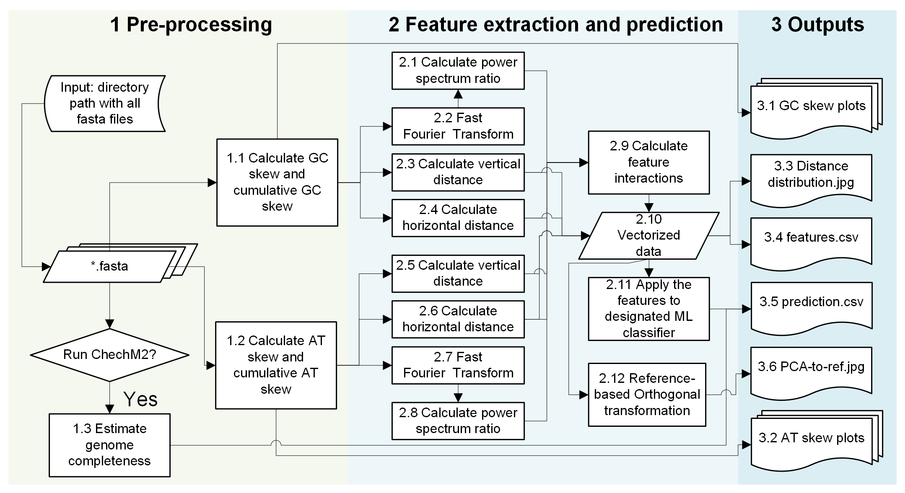

# Summary
BacterialPloidyPredictor is a Python-based package that batch predicts the bacterial polyploidy based off of global genomic architecture. BacterialPloidyPredictor automates the extraction of features from complete assemblies of bacterial species, and predicts polyploidy by feeding extracted features into pre-trained machine learning models. Besides, the package provides a series of visualizations to help comprehend the difference in global genomic architecture, and estimate the confidence of the prediction. For instance, it visualizes the global genomic features used to predict polyploidy, the place of the sample(s) in the 3-dimentional PCA space generated by training data, and the Euclidean distance to the closest reference point among the distribution formed by reference points. This package serves as the first tool to predict polyploidy in bacteria, helps to explore the biological significance of polyploidy as a prevalent phenotype, and potentiates ploidy quantificstion in the future. 

# Statement of need
Recent predictions challenges the previous consensus that most bacteria are monoploids [@Soppa2022-kb]. If true, this new finding could significantly change the way to study microbiology. For example, microbiome-wide association study (MWAS) has bee developed to find bacterial taxa associated with diseases and disorders [@Gilbert2016-cl; @Surana2017-kq]. This method is built based on the assumption that all bacteria are monoploidy. If majority of bacteria are polyploids, the normalization of bacterial abundance based on ploidy level becomes necessary to cancel the overrepresentation of species, and can thus help identify species with a higher significance in disease onset or development [@Soppa2017-uc]. Furthermore, it becomes clear that polyploid bacteria co-exist with monoploid bacteria, this observation further raises the question about the biological significance of polyploidy beside the ones that have been previously revealed [@Van_de_Peer2017-vq]. However, several factors hinders the further investigation of this topic: First, the number of bacteria with quantified ploidy level is limited for the development of prediction tools that rely on big amount of data for their training; second, the dynamic nature of polyploidy makes the collection trickier. For example, some, if not all, monoploid bacteria such as *E.coli* can go through polyploidization during fast growing phase, which is termed mero-polyploidy. This phenomenon is believed to increases the gene dosage to support its fast growth [@Hu2025-hi], which complicates the quantification of true polyploidy as the ploidy is a dynamic range. To differentiate, polyploidy is defined as the mantenance of multiple copies of chromosomes at all growing phase in this work. To help obtain a mechanistic understanding of this phenotype, this package is developed to perform a binary prediction based on global genomic architectures. Alongside the prediction, we provide a series of statistics that help to assess the confidence of the prediction.  

# Implementation
BacterialPloidyPredictor samples complete genome assemblies in batch to extract the features associated with global genomic architecture, including GC skew, AT skew, and a series of other genomic features derived from the characterization of nucleotide bias [@Arakawa2007-ks; Arakawa2009-bx]. These features are then used as input for three pre-trained different machine learning models based on logistic regression, XGBoost, and k-nearest neighbors (kNN). Although optimized during the development, parameters can be fine-tuned according to researcher's need. Use of defalut parameters can already give users a biologically meaningful prediction, allowing them focus on the correlational or causational interpretation of this phenotype with minimal inteference with parameters. Besides, a series of plots visualize the confidence of prediction and the relationships with lebeled trainng data. (\autoref{fig:workflow})

Since bactetial polyploidy is a less investigated from a eco-evolutionary perspective, BactertialPloidyPredictor provides the following functions:
- **Automation of pre-processing and feature extraction**:
  BacterialPloidyPredictor treats *.fasta/*.fna/*.fa files containing complete genome assemblies as input, and gives them an optional genome completeness inspection using CheckM2. Extracted features including genomic GC skew, genomic AT skew, relative distances between replication origin and replication terminus and their interaction terms are used for downstream prediction.
- **Prediction of monoploidy/polyploidy based on extracted features**:
  Use either pre-trained models including logistic regression, XGBoost, or kNN (default) to predict the species being monoploidy or polyploidy.
- **Illustration extracted features**:
  Extracted features including GC skew, AT skew, and mutual information between predictors will be provided. 
- **Estimation of prediction confidence**:
  If using kNN, the Euclidean distance between samples and their closest reference points will be calculated and placed in the distribution of pairwise Euclidean distance among reference data. A metric will be provided to quantify the relative confidence of the prediction. 3-dimentional PCA space will be visualized as well with sampling data and reference data.

# Outputs

# Acknowledgement

# References
